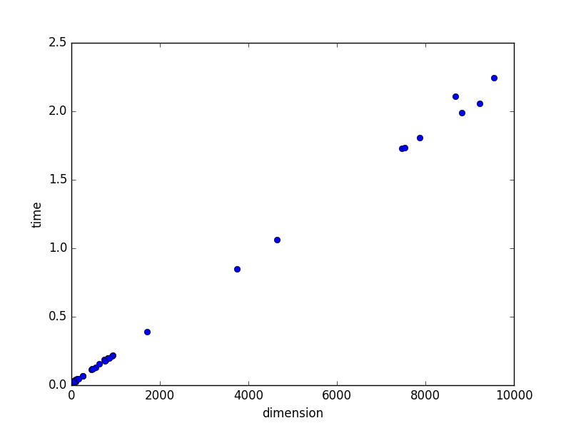
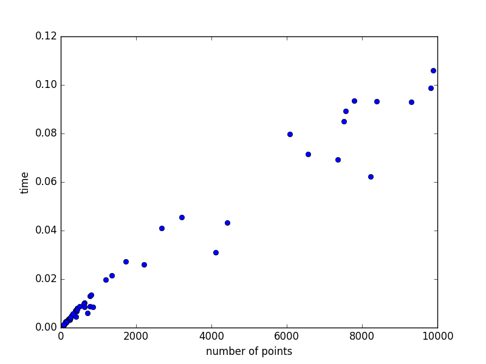
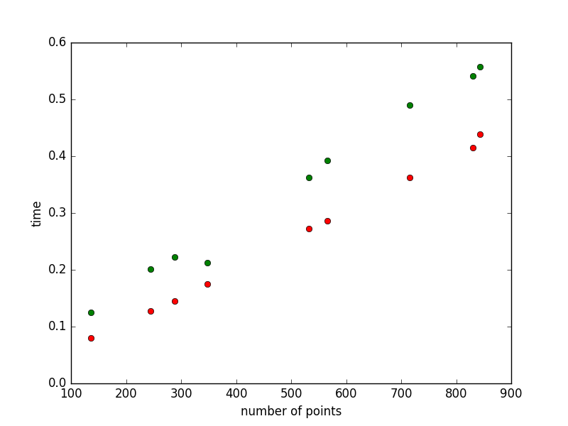
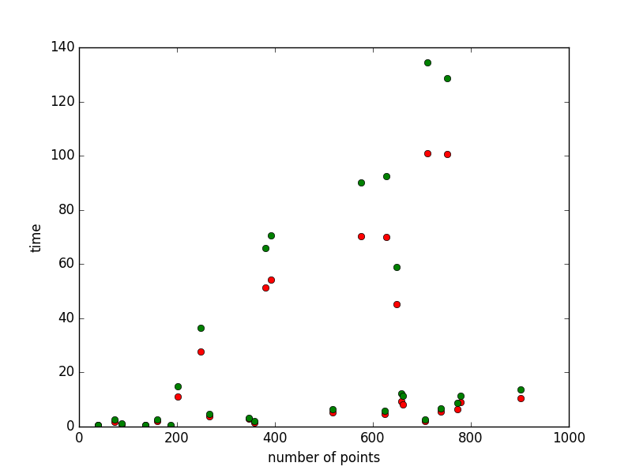
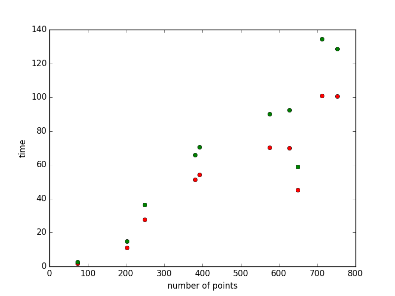

# SNNAHDD

Scalable Nearest Neighbor Algorithms for High Dimensional Data

The main goal of this project is to implement several Data Structures(Trees) that are efficient for Nearest Neighbour Search in higher dimensional data. 
A detailed description of these Data Structures is presented in [This paper](https://github.com/CHoudrouge4/SNNAHDD/blob/master/06809191.pdf).

## Step Zero
This step is implementing **The k-d Tree**.

1. Current Status:
	* Constructing The Tree: **done**
	* Querying  The tree: **done**
	* Allowing The user to specify the distance function.
2. Testing:
	we started testing our algorithm by comparing it to the naive algorithm in order to show its correctness and to compare its efficiency.The testing is done over a random set of points with different dimensionality chosen from a uniform distribution.In addition, we computed the construction time for the tree with respect to the number of points and to space's dimension. (for more details check main.cpp)

Graph for some results:
Construction time(in seconds) with respect to the dimensionality:

Construction time(in seconds) with respect to the number of points with fixed dimension equls to two:

Camparaision between kd-tree search algorithm (in green) and the naive algorithm (in red).
For dimensions between 1 and 100.(time in seconds/number of points)

For dimensions between 100 and 1000.(time in seconds/number of points)

For dimensions between 1000 and 10000.(time in seconds/number of points)

## Step One
This step is implementing **The Randomized k-d Tree**

## Step Two
This Step is implementing **The Priority Search K-Means Tree**

