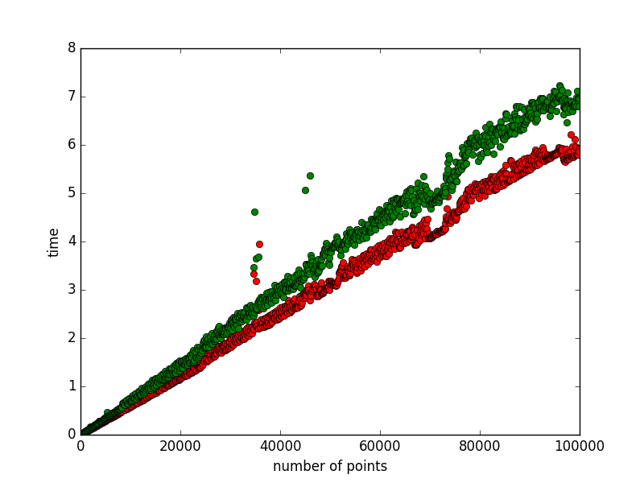

# SNNAHDD

Scalable Nearest Neighbor Algorithms for High Dimensional Data

The main goal of this project is to implement several Data Structures(Trees) that are efficient for Nearest Neighbour Search in higher dimensional data. 
A detailed description of these Data Structures is presented in [This paper](https://github.com/CHoudrouge4/SNNAHDD/blob/master/06809191.pdf).

## Step Zero
This step is implementing **The k-d Tree**.

1. Current Status:
	* Constructing The Tree: **done**
	* Querying  The tree: **done**
	* Allowing The user to specify the distance function.
2. Testing:
	we started testing our algorithm by comparing it to the naive algorithm in order to show its correctness and to compare its efficiency.The testing is done over a random set of points with different dimensionality chosen from a uniform distribution.In addition, we computed the construction time for the tree with respect to the number of points and to space's dimension. (for more details check main.cpp)

Graphs for some results:
Construction time(in seconds) with respect to the dimensionality:

Construction time(in seconds) with respect to the number of points with fixed dimension equls to two:

Comment on the results: k-d tree performs very well in low dimensions. This result is obvious from the first and the second graph. However, the performance of the k-d tree decreases drastically when the dimension is high. The third and the fourth graph demonstrate this fact. This will lead us to start implementing step one and two to get a better performance in higher dimensions.  

Camparaision between kd-tree search algorithm (in green) and the naive algorithm (in red).
For dimension equals to 2 and number of points ranges between 10 and 100000.(time in seconds/number of points)

For dimension equals to 3 and number of points ranges between 10 and 10000.(time in seconds/number of points)

For dimension equals to 15 and number of points equals 10000.(time in seconds/number of points)

For dimension equals to 15 and number of points equals 100000.(time in seconds/number of points)

## Step One
This step is implementing **The Randomized k-d Tree**

1. Current Status:
	* Constructing The Tree: **done**
	* Querying  The tree: **Need Improvement**
2. Testing:
	Similarly to the k-d tree, we tested the randomized k-d tree algorithm by comporing it to the naive algorithm in order to show its correctness and to compare its efficiency. the testing is done over a random set of points shosen from a uniform distribution. 
	We computed the construction time for a randomied k-d forest of size 20 over set of points of dimension equals to 25.

Graphs for some results:
Construction time(in seconds) for 20 trees with respect to the number of points(with dimension equals to 25).

Construction time(in seconds) for 20 trees with respect to the dimension (with 1000 points for each dimension).

## Step Two
This Step is implementing **The Priority Search K-Means Tree**

## Step Three
TBA.

