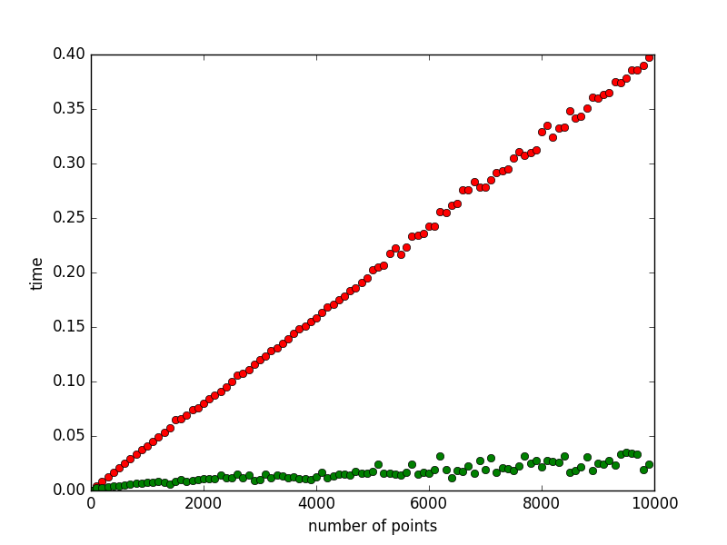

# SNNAHDD

Scalable Nearest Neighbor Algorithms for High Dimensional Data

The main goal of this project is to implement several Data Structures(Trees) that are efficient for Nearest Neighbour Search in higher dimensional data.
A detailed description of these Data Structures is presented in [This paper](https://github.com/CHoudrouge4/SNNAHDD/blob/master/06809191.pdf).

## Step Zero
This step is implementing **The k-d Tree**.

1. Current Status:
	* Constructing The Tree: **done**
	* Querying  The tree: **done**
	* Allowing The user to specify the distance function.
2. Testing:
	we started testing our algorithm by comparing it to the naive algorithm in order to show its correctness and to compare its efficiency.The testing is done on a random set of points with different dimensionality chosen from a uniform distribution.In addition, we computed the construction time for the tree with respect to the number of points and to space's dimension. (for more details check main.cpp)

Graphs for some results:
Construction time(in seconds) with respect to the dimensionality:

Construction time(in seconds) with respect to the number of points with fixed dimension equals to two:

Comment on the results: k-d tree performs very well in low dimensions. This result is obvious from the first and the second graph. However, the performance of the k-d tree decreases drastically when the dimension is high. The third and the fourth graph demonstrate this fact. This will lead us to start implementing step one and two to get a better performance in higher dimensions.

Comparison between kd-tree search algorithm (in green) and the naive algorithm (in red).
For dimension equals 2 and number of points ranges between 10 and 100000.(time in seconds/number of points)

For dimension equals 3 and number of points ranges between 10 and 10000.(time in seconds/number of points)

For dimension equals 15 and number of points equals 10000.(time in seconds/number of points)

For dimension equals 15 and number of points equals 100000.(time in seconds/number of points)

## Step One
This step is implementing **The Randomized k-d Tree.**

1. Current Status:
	* Constructing The Tree: **done**
	* Querying  The tree: **done**
2. Testing:
	Similarly to the k-d tree, we tested the randomized k-d tree algorithm by comparing it to the naive algorithm in order to show its correctness and to compare its efficiency. the testing is done over a random set of points chosen from a uniform distribution.
	We computed the construction time for a randomized k-d forest of size 20 over a set of points of dimension equals to 25.
	Furthermore, we tested the search algorithm for different forest size in a fixed dimension, and we computed the precision for each size.

Graphs for some results:
Construction time(in seconds) for 20 trees with respect to the number of points(with dimension equals to 25).

Construction time(in seconds) for 20 trees with respect to the dimension (with 1000 points for each dimension).

Search time(in seconds) for 15 trees with respect to the number of points(with dimension equals to 10). The search precision is equal to 81.5% (the number of explored leafs is 17).

Search time(in seconds) for 20 trees with respect to the number of points(with dimension equals to 10). The search precision is equal to 73.62% (the number of explored leafs is 15).

Search time(in seconds) for 25 trees with respect to the number of points(with dimension equals to 10). The search precision is equal to 74.38% (the number of explored leafs is 15).

Search time(in seconds) for 25 trees with respect to the number of points(with dimension equals to 10). The search precision is equal to 92.99% (the number of explored leafs is 20).

In addition, we tested the relation between the number of trees/number of leafs and the precision/performance.

In all of these tests, the number of points (space size) is equal to 10000, the query size equals to 100, and the dimension equals to 10.
For the performance/number of trees and precision/number of trees, the number of leafs was fixed to 16.
For the performance/number of leafs and precision/number of leafs, the number of trees was fixed to 20.

The following graph represents the change of the performance with respect to the number of leafs.

The following graph represents the change of the performance with respect to the number of trees;

The following graph represents the change of precision with respect to the number of leafs.

The following graph represents the change of precision with respect to the number of trees.

Now, we present the performance(in red) and the precision(in green) with respect to number of visited leafs on the same graph.

and the following one combines the performance(in red) and the precision(in green) with respect to number of trees.

## Step Two
This Step is implementing **The Priority Search K-Means Tree**

1. Current Status:
	* Constructing The Tree: **done**
	* Querying  The tree: **done**

## Step Three
General Testing

In this step, we will show comparison between the previous three algorithms.
We will conduct our testing in three different data instances. The first one is SIFT (Scale-invariant feature transform). The second one is data sampled from Normal distribution. The last one is data sampled from Uniform distribution.

**SIFT DATA**

The following graphs show the construction time for the three trees (algorithm);
the k-d tree in red, randomized k-d tree forest(10 trees) in blue, and the k-means Priority tree(k = 4, maximum number of iterations = 30) in green.

In addition to the construction time, we measured the search performance of the algorithms (Kd-Tree, Randomized Kd-Trees, Priority K-means Tree).

The Randomized Kd-Trees (in blue) have the best performance in term of accuracy and speed, then it comes the Priority K-means Tree (in green). However, the Kd-Tree (in red) and Linear search (in yellow) have similar performance.

For the Randomized Kd-trees and The Priority K-means Tree, we counted the correct solution to a factor of epsilon.

i.e d(p, q) <= (1 + epsilon) d(P_k, q)
where q is the query point, d is the distance function.
For the Priority k-means tree testing, P_k is the kth furthest point from the true correct answer.
For the Randomized kd-trees testing, P_k is the correct answer returned by linear search.
Therefore, p is a correct solution if it satisfies the above inequality.

By increases epsilon from 0.3 to 0.7, the precision increases from 87% to 99% for the Randomized K-tree, and it increases from 70 to 80% for the Priority K-means Tree.
In addition, increasing the k parameter for the Priority k-means tree from 4 to 16 with epsilon fixed to 0.7 increases the precision from 80 % to 99%.

After, we measured the effect of changing the parameters for the Randomized k-d Trees and for the Priority K-means Tree.
### Randomized kd-trees
First, we fixed all the parameters. then, we tested how the number of trees in the k-d tree forest affect the performance (measured in seconds).  
The following graph illustrates the results.

From the graph, we can notice that the performance decreases quickly to reach certain value where increasing the number of trees becomes ineffective.
However, the number of trees does not show a significant influence on the precision of the result.

In addition, we tested the effect of the number of visited leafs on the performance and on the precision of the search results.
we did this experiment for epsilon equals to 0.3 and 0.7.
The following graph illustrates the result where the precision is measured in percentage (The red plot)
and the performance is measured in seconds (The yellow plot).

For epsilon = 0.3

For epsilon = 0.7

### Priority k-means tree
For the Priority k-means tree, we tested the affect of changing the value of k and the maximum number of iterations.
For the value of k, we measured the impact on the performance(in seconds, colored in red) and on the precision (in percentage, colored in yellow).
The following graph illustrates the result.

we noticed that the performance decreases slowly as k increases. However, the precision does not have a regular pattern, but for a certain K it takes a maximal value and remains constant.

Concerning the number of iterations, we noticed that this parameters does not have a significant impact on the performance and the precision.

